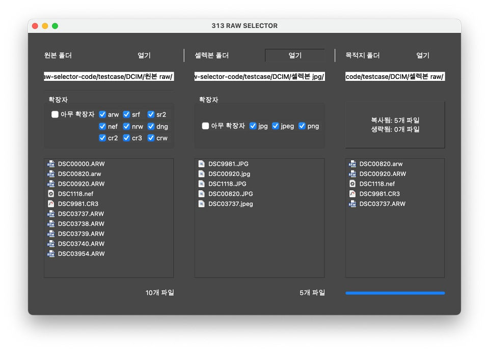
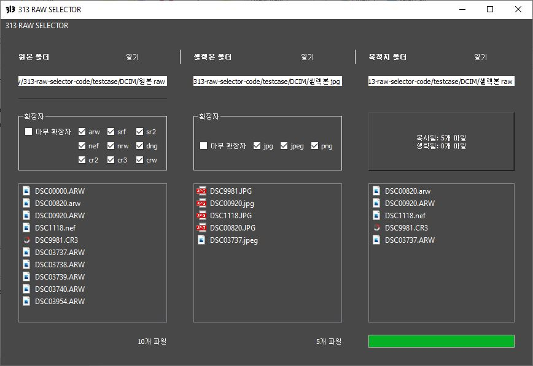

# 313-raw-selector

- 전체 원본 raw 파일이 든 폴더
- 일부 셀렉본 jpg 파일이 든 폴더

가 주어졌을 때, 셀렉본 파일명에 대응되는 원본 raw 파일들을 자동으로 목적지 폴더에 복사하는 프로그램입니다.

---

- 업데이트: [github.com/313usually/313-raw-selector/releases](https://github.com/313usually/313-raw-selector/releases)
- 이메일: 313microambitious@gmail.com
- 개발자: [instagram.com/micro_ambitious](https://www.instagram.com/micro_ambitious/)